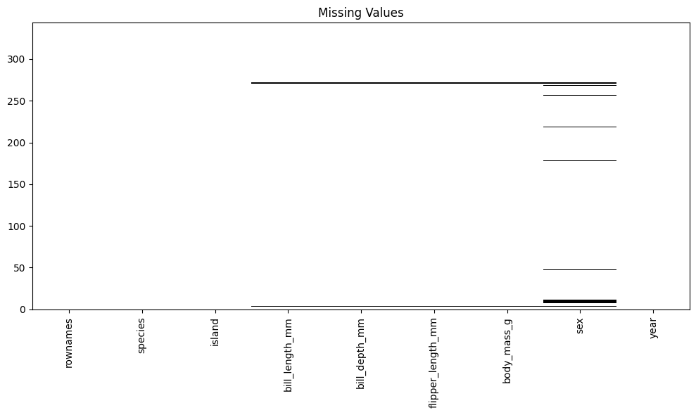
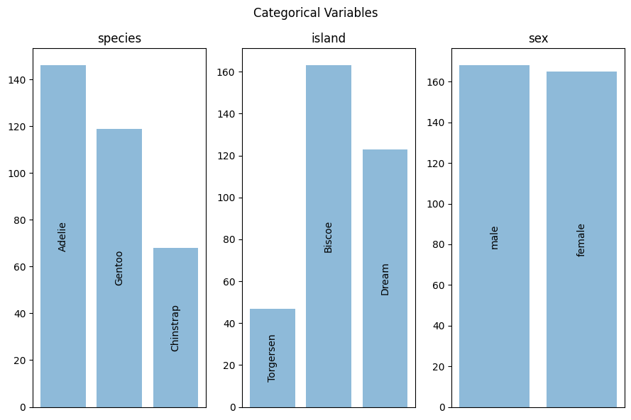
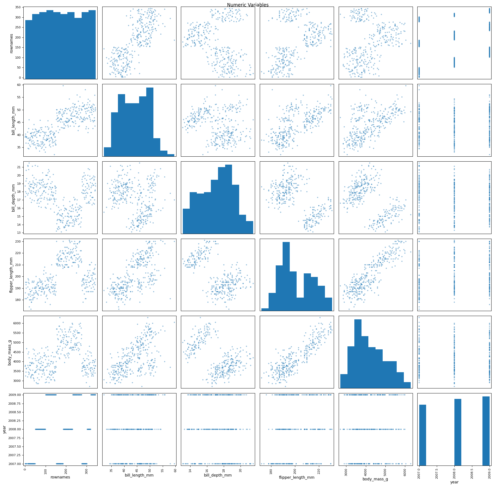
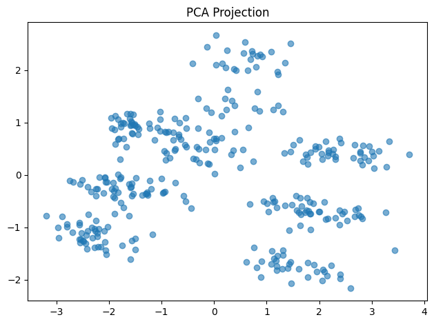

# rdatasets

Convenience interface of Rdatasets for lazy data scientists.

## Install

Use pip.

```
pip install .
```

## Usage

### Finding datasets

#### 1. Exact match on the package and item names

This is almost the same as [statsmodels.datasets.get_rdatasets](https://www.statsmodels.org/stable/datasets/statsmodels.datasets.get_rdataset.html).

```Python
>>> from rdatasets import Rdatasets

>>> rd = Rdatasets.find(package="palmerpenguins", item="penguin", exact=True)
```

#### 2. Search a string in the title of datasets

Find datasets that have "penguin" in their title:

```Python
>>> from rdatasets import Rdatasets

>>> rd = Rdatasets.find(title="penguin")
```

#### 3. Filtering datasets that contains particular types of variables

Find datasets that have categorical variables:

```Python
>>> from rdatasets import Rdatasets

>>> rd = Rdatasets.find(categorical=True)
```

Find datasets that have only one numeric variables with more than 99 samples:

```Python
>>> from rdatasets import Rdatasets

>>> rd = Rdatasets.find(numeric=True, nmin=100, pmax=1)
```

### Getting a single dataset from Rdatasets

Below, `rd` is the output of the following code block:

```Python
>>> from rdatasets import Rdatasets

>>> rd = Rdatasets.find(title="penguin")
```

#### 1. Show the list of datasets that matched the conditions

```Python
>>> rd  # On jupyter, this will show the same result as below.
>>> rd.catalog  # Show the repr of DataFrame

        Package	        Item	                Title   ...
567     bayesrules	    penguins_bayes	        Penguins Data
1694	heplots	        peng	                Size measurements ...
2116	modeldata	    penguins	            Palmer Station penguin data
2559	palmerpenguins	penguins	            Size measurements for  ...
2560	palmerpenguins	penguins_raw (penguins) Penguin size, clutch, ...
```

#### 2. Pick the first dataset in the list

```Python
>>> rd.first

#️⃣ Index  : 567
📦 Package: bayesrules
📄 Item   : penguins_bayes
📚 Title  : Penguins Data
📐 Shape  : (344, 10)
  ⚖️ Binary   : 2
  🔤 Character: 0
  🧮 Factor   : 4
  🔘 Logical  : 0
  🔢 Numeric  : 5
🔗 CSV: https://vincentarelbundock.github.io/Rdatasets/csv/bayesrules/penguins_bayes.csv
🔗 Doc: https://vincentarelbundock.github.io/Rdatasets/doc/bayesrules/penguins_bayes.html
```

#### 3. Acceess by `Index` and position in the catalog

```Python
>>> rd[2559]  # Get the Dataset with its index 2559 (pandas.DataFrame.loc), or ...
>>> rd.at(3)  # Get the Dataset at position 3 in the catalog (pandas.DataFrame.iloc)

#️⃣ Index  : 2559
📦 Package: palmerpenguins
📄 Item   : penguins
📚 Title  : Size measurements for adult foraging penguins near Palmer Station, Antarctica
📐 Shape  : (344, 9)
  ⚖️ Binary   : 1
  🔤 Character: 0
  🧮 Factor   : 3
  🔘 Logical  : 0
  🔢 Numeric  : 5
🔗 CSV: https://vincentarelbundock.github.io/Rdatasets/csv/palmerpenguins/penguins.csv
🔗 Doc: https://vincentarelbundock.github.io/Rdatasets/doc/palmerpenguins/penguins.html
```

### Getting the dataframe

```Python
>>> ds = rd[2559]
>>> ds.data  # -> pandas.DataFrame

   rownames species     island  bill_length_mm  bill_depth_mm ...
0         1  Adelie  Torgersen            39.1           18.7
1         2  Adelie  Torgersen            39.5           17.4
2         3  Adelie  Torgersen            40.3           18.0
3         4  Adelie  Torgersen             NaN            NaN
4         5  Adelie  Torgersen            36.7           19.3
...
```

### Quicklook

Selected dataset can be easily quicklooked:

```Python
>>> ds.quicklook()
```

|Missing Values|Categorical Variables|Numeric Variables(p≧1)|Numerical Variables (p≧3)|
|----|-----|------|----------|
| | | | 
|Heatmap|Bar plots|Scatter matrix (p≧2) / histogram (p=1)|PCA projection (p≧3)
